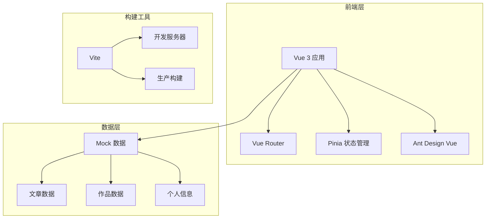

# 技术架构文档 - Mayekun 作品博客网站

## 1. 架构设计



## 2. 技术说明

- **前端框架**：Vue 3 + Composition API
- **UI 组件库**：Ant Design Vue 4.x
- **状态管理**：Pinia
- **路由管理**：Vue Router 4
- **样式方案**：Less + CSS Variables
- **构建工具**：Vite 5.x
- **Markdown 渲染**：markdown-it + highlight.js
- **动画库**：@vueuse/motion
- **数据存储**：本地 Mock 数据（JSON 文件）

## 3. 路由定义

| 路由路径 | 页面名称 | 说明 |
|---------|---------|------|
| `/` | 首页 | 展示精选内容和作品 |
| `/articles` | 文章列表 | 所有文章列表，支持分类筛选 |
| `/article/:id` | 文章详情 | 单篇文章详细内容 |
| `/about` | 关于页面 | 个人介绍和联系方式 |
| `/works` | 作品展示 | 作品集展示页面 |

## 4. 项目结构

```
mayekun-ui/
├── public/
│   └── favicon.ico
├── src/
│   ├── assets/           # 静态资源
│   │   ├── images/
│   │   └── styles/
│   ├── components/       # 公共组件
│   │   ├── layout/       # 布局组件
│   │   ├── article/      # 文章相关组件
│   │   └── common/       # 通用组件
│   ├── views/            # 页面视图
│   │   ├── Home.vue
│   │   ├── Articles.vue
│   │   ├── ArticleDetail.vue
│   │   ├── About.vue
│   │   └── Works.vue
│   ├── router/           # 路由配置
│   ├── store/            # 状态管理
│   ├── mock/             # Mock 数据
│   ├── utils/            # 工具函数
│   ├── App.vue
│   └── main.js
├── index.html
├── vite.config.js
└── package.json
```

## 5. 组件设计

### 5.1 布局组件
- **AppHeader**：顶部导航栏，包含 Logo、菜单、主题切换
- **AppFooter**：底部信息栏，版权信息、社交链接
- **AppLayout**：页面布局容器，处理响应式布局

### 5.2 业务组件
- **ArticleCard**：文章卡片，展示文章预览信息
- **ArticleList**：文章列表，支持分页和筛选
- **ArticleToc**：文章目录导航
- **WorkCard**：作品卡片，展示作品预览
- **HeroSection**：首页 Hero 展示区
- **SkillBar**：技能进度条

## 6. 数据模型

### 6.1 文章数据模型

```typescript
interface Article {
  id: string;
  title: string;
  summary: string;
  content: string;
  cover: string;
  category: string;
  tags: string[];
  author: string;
  createdAt: string;
  updatedAt: string;
  readTime: number;
  views: number;
}
```

### 6.2 作品数据模型

```typescript
interface Work {
  id: string;
  title: string;
  description: string;
  cover: string;
  images: string[];
  category: string;
  tags: string[];
  link: string;
  github?: string;
  createdAt: string;
}
```

### 6.3 个人信息模型

```typescript
interface Profile {
  name: string;
  avatar: string;
  bio: string;
  title: string;
  location: string;
  email: string;
  social: {
    github?: string;
    twitter?: string;
    linkedin?: string;
    weibo?: string;
  };
  skills: {
    name: string;
    level: number;
    category: string;
  }[];
}
```

## 7. 性能优化

- **图片懒加载**：使用 Intersection Observer 实现图片懒加载
- **路由懒加载**：页面组件按需加载，减少首屏加载时间
- **代码分割**：第三方库单独打包，利用浏览器缓存
- **资源压缩**：生产环境开启 Gzip 压缩
- **CDN 加速**：静态资源使用 CDN 分发

## 8. SEO 优化

- **Meta 标签**：每个页面配置独立的 title、description、keywords
- **语义化 HTML**：使用语义化标签提升可访问性
- **结构化数据**：添加 JSON-LD 结构化数据
- **站点地图**：生成 sitemap.xml
- **RSS 订阅**：提供 RSS 订阅功能
